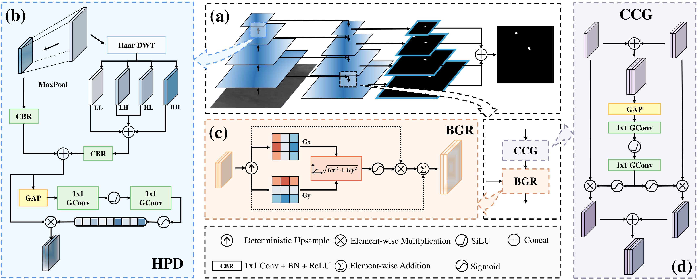
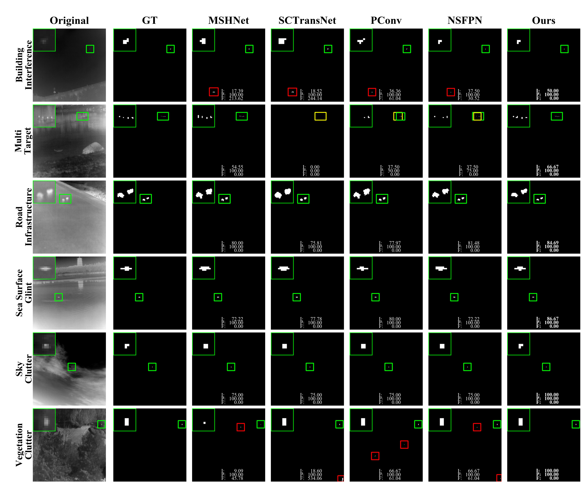

# SEG-UNet: Spectral--Edge Gated U-Net for Real-Time Infrared Small Target Detection

Official PyTorch implementation of the paper **"SEG-UNet: Spectral--Edge Gated U-Net for Real-Time Infrared Small Target Detection"**.

---

## Abstract

Infrared small-target detection (IRSTD) remains challenging due to low thermal contrast, complex background clutter, and the extremely small spatial extent of target signatures. Conventional encoder-decoder architectures often struggle in these low-signal thermal scenarios because spatial downsampling can weaken fine target responses, skip connections may propagate clutter-dominated features, and generic upsampling can distort compact target boundaries.

To address these limitations, we propose **SEG-UNet**, a specialized segmentation framework that incorporates frequency-aware downsampling, cross-scale clutter suppression, and gradient-guided boundary restoration into a unified encoder-decoder architecture:

1. **High-frequency Preserving Downsampler (HPD)**: Combines a MaxPool spatial branch with a Haar-DWT spectral branch that retains all wavelet sub-bands, and adaptively fuses the two branches through channel-wise weighting to preserve informative frequency cues during resolution reduction.
2. **Clutter-suppressing Cross-scale Gating (CCG)**: Jointly estimates channel-wise gating weights from encoder and decoder features, adaptively regulating skip-connection information to reduce the propagation of clutter-dominated responses.
3. **Boundary-guided Geometric Restorer (BGR)**: Introduces fixed Sobel-derived gradient cues after spatial upsampling to guide feature refinement and improve the reconstruction of compact target boundaries.

Extensive experiments on the **IRSTD-1K** and **NUAA-SIRST** benchmarks demonstrate the effectiveness of SEG-UNet. The model achieves **70.14% IoU** on IRSTD-1K and **78.57% IoU** on NUAA-SIRST, while obtaining the lowest false-alarm rates of **4.71 × 10⁻⁶** and **1.06 × 10⁻⁶**, respectively. Despite its lightweight design, SEG-UNet contains only **4.92M parameters** and **7.00G FLOPs**, and achieves real-time inference at **58.46 FPS** on an NVIDIA RTX 4090 GPU.

---

## Architecture Overview



*Figure 1: Overall architecture of SEG-UNet and its specialized structural components:
(a) Macro Backbone, (b) High-frequency Preserving Downsampler (HPD),
(c) Boundary-guided Geometric Restorer (BGR), and
(d) Clutter-suppressing Cross-scale Gating (CCG).*

---

## Quantitative & Qualitative Results

### Benchmark Quantitative Comparison on IRSTD-1k and NUAA-SIRST

> **Note**: **Bold** indicates the best score, and <u>underline</u> indicates the second-best score.

| Method                     |      Type      | IRSTD-1k $IoU$ (%) ↑ | IRSTD-1k $P_d$ (%) ↑ | IRSTD-1k $F_a$ ($\times 10^{-6}$) ↓ | NUAA-SIRST $IoU$ (%) ↑ | NUAA-SIRST $P_d$ (%) ↑ | NUAA-SIRST $F_a$ ($\times 10^{-6}$) ↓ |
| :------------------------- | :------------: | :------------------: | :------------------: | :---------------------------------: | :--------------------: | :--------------------: | :-----------------------------------: |
| **Max-Median** (1999)      |   Filtering    |         7.00         |        65.21         |                59.73                |          4.17          |         69.20          |                 55.33                 |
| **Top-Hat** (2010)         |   Filtering    |        10.06         |        75.11         |                1432                 |          7.14          |         79.84          |                 1012                  |
| **TLLCM** (2020)           | Local Contrast |         3.31         |        77.39         |                6738                 |          1.03          |         79.09          |                 5899                  |
| **WSLCM** (2021)           | Local Contrast |         3.45         |        72.44         |                6619                 |          1.16          |         77.95          |                 5446                  |
| **IPI** (2013)             |    Low Rank    |        27.92         |        81.37         |                16.18                |         25.67          |         85.55          |                 11.47                 |
| **RIPT** (2017)            |    Low Rank    |        14.11         |        77.55         |                28.31                |         11.05          |         79.08          |                 22.61                 |
| **NRAM** (2018)            |    Low Rank    |        15.25         |        70.68         |                16.93                |         15.25          |         70.68          |                 16.93                 |
| **PSTNN** (2019)           |    Low Rank    |        24.57         |        71.99         |                35.26                |         30.30          |         72.80          |                 48.99                 |
| **MSLSTIPT** (2021)        |    Low Rank    |        11.43         |        79.03         |                1524                 |          1.08          |          0.05          |                 8.18                  |
| **MDvsFA** (ICCV 2019)     | Deep Learning  |        37.34         |        83.71         |                88.52                |         60.30          |         89.35          |                 56.35                 |
| **ACMNet** (WACV 2021)     | Deep Learning  |        59.23         |        93.27         |                65.28                |         70.77          |         93.08          |                 3.70                  |
| **ALCNet** (TGRS 2021)     | Deep Learning  |        65.68         |        89.25         |                27.71                |         73.74          |         97.25          |                 26.79                 |
| **ISNet** (CVPR 2022)      | Deep Learning  |        62.88         |        92.59         |                27.92                |         74.16          |         97.99          |                 8.35                  |
| **DNANet** (TIP 2023)      | Deep Learning  |        65.71         |        91.84         |                17.61                |         74.31          |         98.17          |                 15.97                 |
| **UIUNet** (TIP 2023)      | Deep Learning  |        65.06         |        91.16         |                12.68                |         72.69          |      <u>99.08</u>      |                 26.61                 |
| **IRPruneDet** (AAAI 2024) | Deep Learning  |        64.54         |        91.74         |                16.04                |         75.12          |         98.61          |                 2.96                  |
| **MSHNet** (CVPR 2024)     | Deep Learning  |        67.16         |     <u>93.88</u>     |                15.03                |         74.60          |      <u>99.08</u>      |                 17.21                 |
| **IRSAM** (ECCV 2024)      | Deep Learning  |        64.65         |        90.57         |                16.61                |         71.44          |         92.66          |                 7.53                  |
| **HCFNet** (ICME 2024)     | Deep Learning  |        64.26         |        92.86         |                23.91                |         72.74          |         98.17          |                 6.21                  |
| **SCTransNet** (TGRS 2024) | Deep Learning  |        68.64         |        91.84         |                11.92                |         77.09          |         98.17          |                 15.26                 |
| **PConv** (AAAI 2025)      | Deep Learning  |        67.08         |        92.18         |                11.92                |         76.25          |      <u>99.08</u>      |                 6.74                  |
| **SFCANet** (TAES 2025)    | Deep Learning  |        66.68         |        92.89         |                12.69                |         78.46          |         97.24          |                 8.02                  |
| **NS-FPN** (CVPR 2026)     | Deep Learning  |     <u>69.29</u>     |      **95.24**       |             <u>8.58</u>             |       **78.75**        |       **100.0**        |              <u>1.60</u>              |
| **MPCNet** (TGRS 2026)     | Deep Learning  |        67.24         |        92.26         |                11.41                |         77.47          |         96.20          |                 13.72                 |
| **SEG-UNet (Ours)**        | Deep Learning  |      **70.14**       |     <u>93.88</u>     |              **4.71**               |      <u>78.57</u>      |       **100.0**        |               **1.06**                |

---

### Qualitative Comparison across Complex Scenarios



*Figure 2: Qualitative comparison of SEG-UNet against representative state-of-the-art methods across six challenging IRSTD scenarios: Building Interference, Multi Target, Road Infrastructure, Sea Surface Glint, Sky Clutter, and Vegetation Clutter. Red, yellow, and green boxes denote false alarms, missed detections, and correct detections, respectively.*

---

## Repository Structure

```text
SEG-UNet/
├── assets/
│   ├── overview.png        # Architecture Overview Diagram (Figure 1)
│   └── visual_result.png   # Qualitative Visual Comparison (Figure 2)
├── model/
│   ├── __init__.py
│   ├── SEG_UNet.py         # Main SEG-UNet model (HPD, CCG, BGR modules)
│   └── loss.py             # Scale-and-Location Sensitive Loss (SLSIoULoss)
├── utils/
│   ├── __init__.py
│   ├── data.py             # PyTorch Dataset loader (IRSTD-1k, NUAA-SIRST, etc.)
│   └── metric.py           # Metrics computation (mIoU, nIoU, Pd, Fa)
├── train.py                # Main training script
├── test.py                 # Evaluation & inference script
├── requirements.txt        # Minimal Python dependencies
├── .gitignore              # Git ignore rules
└── README.md               # Documentation
```

---

## Environment & Installation

### Requirements

- Python $\ge$ 3.8
- PyTorch $\ge$ 1.10.0
- torchvision $\ge$ 0.11.0
- `pytorch-wavelets` $\ge$ 1.3.0

Install the dependencies:

```bash
pip install -r requirements.txt
```

---

## Usage

### 1. Dataset Preparation

Organize your IRSTD dataset (e.g., IRSTD-1k or NUAA-SIRST) under `./dataset/IRSTD-1k` as follows:

```text
dataset/IRSTD-1k/
├── trainval.txt
├── test.txt
├── images/
│   ├── 000001.png
│   └── ...
└── masks/
    ├── 000001.png
    └── ...
```

### 2. Training

To train SEG-UNet on your dataset:

```bash
python train.py --dataset-dir ./dataset/IRSTD-1k
```

### 3. Model Evaluation

To evaluate a trained checkpoint on the validation/test set:

```bash
python test.py --dataset-dir ./dataset/IRSTD-1k \
               --weight-path ./experiments/SEG_UNet-exp_.../exp01/model_best_iou.pth
```

---

## The best weights

The best model weights are available via Baidu Netdisk:

- **Link**: [https://pan.baidu.com/s/1CWVzREfRSpnh79ktbe812g?pwd=jxeb](https://pan.baidu.com/s/1CWVzREfRSpnh79ktbe812g?pwd=jxeb)
- **Extraction Code**: `jxeb`

---

## Citation

If you find this work useful, please consider citing our paper.  
The BibTeX entry will be updated upon publication.


---

## Acknowledgements

We thank the open-source community and creators of IRSTD benchmark datasets (NUAA-SIRST, IRSTD-1k) and baseline architectures (MSHNet).
